## MAQUINAS VIRTUALES (IaaS)

Son emulaciones de software de computadoras fisicas que constan de un procesador virtual, almacenamiento, memoria y recursos de red.

### Recursos de Azure

- Azure virtual Machines (creacion de maquinas virtuales)
- Azure Virtual Machines Scale Sets (Creacion de VM indenticas)

### Es de utilidad cuando:
- Se requiere un control total del sistema operativo
- Se emplean configuraciones de almacenamiento personalizadas 
- Se ejecuta un software personalizado
- Pasa un servidor fisico a la nube

### Costos
El costo es variable segun lo que se utilice y por cuanto tiempo esta activo el recurso

### Procedimientos

**Creacion de Azure Virtual Machines**

Ingresar e iniciar sesion en [Azure](https://portal.azure.com/#home)

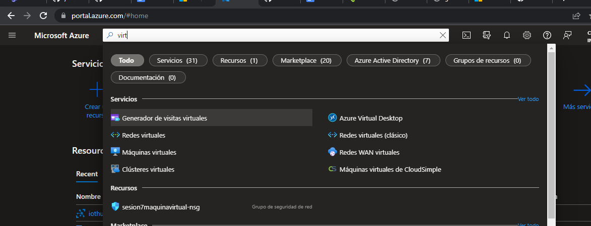

Ir a "maquinas virtuales" y llenar los datos correspondientes para crearlas (en este caso se son dos)

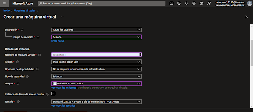
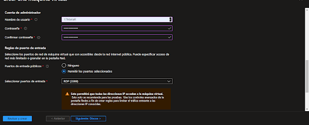

Se espera a la implementacion de maquinas

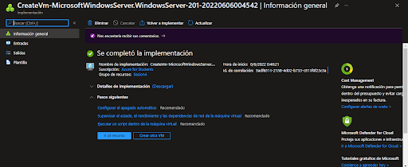

*Creacion de maquina virtual*

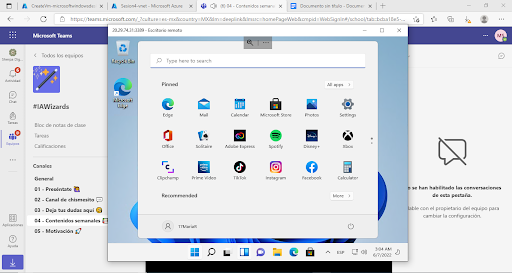

Conexion de dos maquinas virtuales

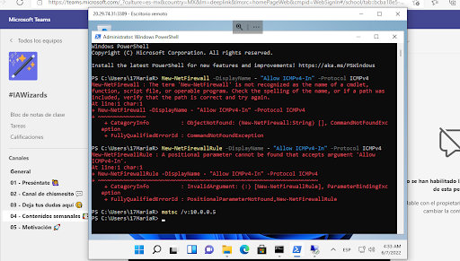

Maquina virtual dentro de otra maquina virtual

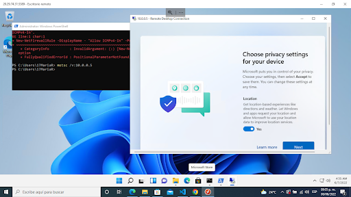

 **NOTA: Importarte detener o eliminar los recursos para evitar gastar todo el credito en Azure**
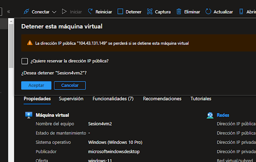

## Crear un App Service (PaaS)

### Recursos de Azure
- Azure App Service

### Es de utilidad cuando:
- Se quiere crear, implementar y escalar rapidamente aplicaciones web, moviles y de API

### Procedimientos

Ingresar al portal de Azure, iniciar sesion. Utilizando el buscador de Azure ---> ***"App Services*** y llenar los datos que se requieran

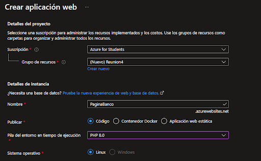
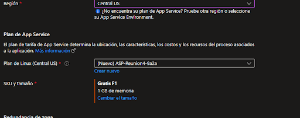
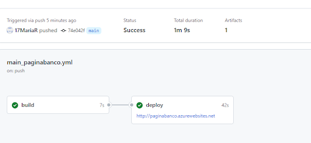
